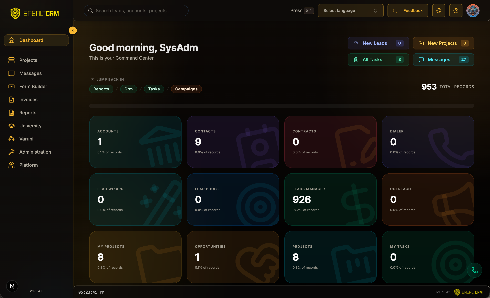
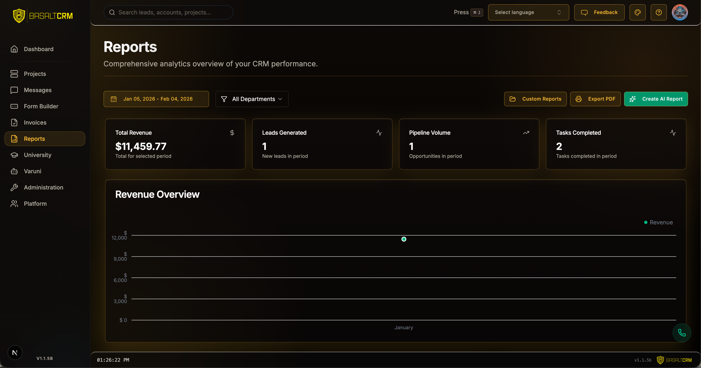

# BasaltCRM

[](https://basalthq.com)

BasaltCRM is a premium open source CRM built on top of Next.js 16 using TypeScript, shadcn/ui, Prisma, and MongoDB. Feature-packed with AI-assisted workflows, intelligent automation, and a next-gen architecture.

[](https://x.com/BasaltHQ)
[](https://github.com/BasaltHQ/crm-official/blob/main/LICENSE)

[Introduction](#introduction) · [Tech Stack + Features](#tech-stack--features) · [Roadmap](#roadmap) · [Installation](#installation) · [Repo activity](#repo-activity) · [License](#license) · [Discord](https://discord.gg/gcgNugyWkg)

---

## Introduction

**Your Business. Supercharged.**

BasaltCRM is the first CRM that doesn't just manage your data—it actively works for you. From finding prospects to closing deals with voice AI, BasaltCRM is your unfair advantage.



## Online Demo

You can try it here [crm.basalthq.com/en/sign-in](https://crm.basalthq.com/en/sign-in). BasaltCRM is free to enroll.

## Tech Stack + Features

### Frameworks

- [Next.js](https://nextjs.org/) – React framework for building performant apps
- [Auth.js](https://authjs.dev/) – Multi-provider authentication
- [Prisma](https://www.prisma.io/) – TypeScript-first ORM
- [React Email](https://react.email/) – Versatile email framework

### Platforms

- [Vercel](https://vercel.com/) – Deployment and previewing
- [Mongo DB Atlas](https://mongodb.com/) – Scalable data management
- [Resend](https://resend.com/) – Email delivery infrastructure

### Data fetching

- [SWR](https://swr.vercel.app/) – Client-side data fetching
- [Axios](https://axios-http.com/) – HTTP client
- [Server Actions](https://nextjs.org/docs/app/building-your-application/data-fetching/server-actions-and-mutations) – Server-side data mutations
- [Tanstack/react-query](https://tanstack.com/query) – State management and fetching

### UI

- [Tailwind CSS](https://tailwindcss.com/) – Utility-first CSS
- [Shadcn/ui](https://ui.shadcn.com/) – Headless components
- [Tremor](https://www.tremor.so/) – Dashboard and charts
- [react.email](https://react.email) – Email templates

### AI

- [OpenAI API](https://openai.com/) – AI-generated communication
- [SURGE](https://surge.basalthq.com) – AI invoice

## Roadmap

### 1. Immediate Focus

- **Effective Automated Outreach**: (Email, Phone, SMS)
- **Efficiency**: Streamlining visual workflows and simple UX.

### 2. Short Term

- **Sales Pipeline**: Enhanced deal management and forecasting.
- **AI Models**: Integration of DeepSeek and Anthropic models.
- **Inbound Calls**: Web-based inbound telephony.

### 3. Long Term

- **Enterprise Scale**: Advanced governance and security tiers.
- **Innovation**: Continuous AI-native feature evolution.

## Emails

We use [Resend](https://resend.com) + [React Email](https://react.email) for templates and delivery.

## Reports

We use Tremor for high-performance dashboard analytics.



## Documentation

Available at: [crm.basalthq.com/en/developers](https://crm.basalthq.com/en/developers)

## Installation

<!-- markdownlint-disable MD033 -->
<details>
<summary><b>Show instructions</b></summary>

1. Clone the repository:

   ```sh
   git clone https://github.com/BasaltHQ/crm-official.git
   cd crm-official
   ```

2. Install dependencies:

   ```sh
   npm install
   ```

3. Setup environment variables:

   ```sh
   cp .env.example .env
   cp .env.local.example .env.local
   ```

4. Initialize Prisma:

   ```sh
   npx prisma generate
   npx prisma db push
   ```

5. Seed initial data:

   ```sh
   npx prisma db seed
   ```

6. Run application:

   ```sh
   npm run dev
   ```

7. Open [http://localhost:3000](http://localhost:3000)

</details>
<!-- markdownlint-enable MD033 -->

## Contact

- [Website](https://basalthq.com)
- [X (Twitter)](https://x.com/BasaltHQ)

## Contributing

We welcome community contributions. Please open an issue for bugs or suggestions.

### BasaltCRM Super Heroes

[](https://github.com/BasaltHQ/crm-official/graphs/contributors)

## Repo Activity


## Star History

[](https://star-history.com/#BasaltHQ/crm-official&Timeline)

## Credits

Special thanks to the original developer:

- **Pavel Dovhomilja** ([@pdovhomilja](https://github.com/pdovhomilja))
- Original Repository: [nextcrm-app](https://github.com/pdovhomilja/nextcrm-app)

## License

Licensed under the [MIT license](https://github.com/BasaltHQ/crm-official/blob/main/LICENSE).
